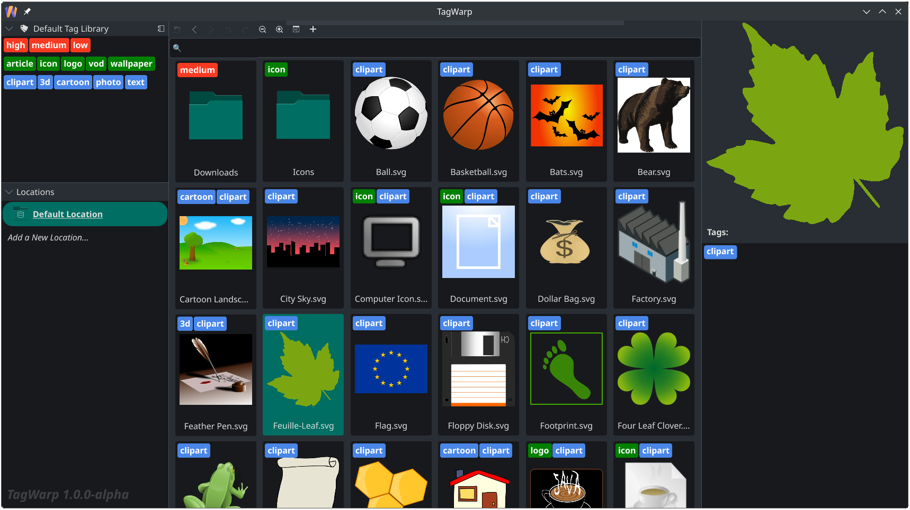

<h1>
  
  TagWarp
</h1>

File tagging software. Native code application for Linux, macOS (not packaged yet) and Windows. Stores tag information in a commonly used open tagging format. Downloads and mods documentation is [here](https://tagwarp.com).

<picture>
  <source media="(prefers-color-scheme: dark)" srcset="assets/TagWarpUI-dark.png">
  <source media="(prefers-color-scheme: light)" srcset="assets/TagWarpUI-light.png">
  
</picture>

# Quick Start

Requires a fairly modern GPU, so if there is an error at start, that may be it.

Opening a folder and tagging:

# Development Status

Insider Alpha. Discuss in Discord threads, GitHub Discussions and GitHub Issues.

## Features Status

### Implemented

- File tagging with some simple undo/redo and navigation history.
- Parent tags, categories.
- Search by tags and file names.
- Usual file operations like in a file manager.
- Fullscreen preview.
- Multiple tag libraries.
- Multiple locations with multiple roots per location.
- Multiple windows and tabs, command palette.
- Several storage options for the tags: centralized, distributed, consolidated.
- Hiding and blurring thumbnails.
- File preview support status: images and video.
- QML and native modding systems.

### In the Implementation Phase

- Audio thumbnails.
- Tag disambiguation, aliases and search for a tag by name.

## Tips

- Root is slow to open when cold (~500k files on SSD, ~50k files on HDD)? - Enable caching for that root.
- Files behave strangely in a root? - Disable caching for that root.
- Tags behave strangely? - <kbd>Shift</kbd>+<kbd>F5</kbd> to restart.
- Doesn't start any more? - Backup and clear Crossetta/TagWarp from `~/.config`, `~/.local/share`, `~/.cache` (or `AppData/` and registry on Windows). Tag libraries are in `~/.local/share`, tags may be there too for the roots that are configured that way.

# TagWarp Repository

This repository is the source material for modding.
Files contain the original implementations that mods can override. [Modding documentation.](https://tagwarp.com/doc/modding/current/intro.html)

Tested on Linux and Wine only, not Windows.

Requires Docker to be installed.

Setting up mods path to load the mods:

- Open settings by pressing <kbd>Alt</kbd> and clicking "Preferences" -> "Settings" on the top menu. Or press <kbd>Ctrl</kbd>+<kbd>Shift</kbd>+<kbd>P</kbd> to open command palette and open settings from there.
- Set the "Mods path" to the "mods" directory of this repository.
- Reload the application using the "Reload QML and Mods" command (<kbd>Ctrl</kbd>+<kbd>Shift</kbd>+<kbd>F5</kbd>).
- Edit the files in the "mods" directory and reload the application with <kbd>Ctrl</kbd>+<kbd>Shift</kbd>+<kbd>F5</kbd>.

Mods:

- `Shortcuts.qml` - keybindings.
- `Preview.qml`, `MiniPreview.qml` - viewing file contents inside TagWarp.
- `mods.cpp` - mod builder.
- `thumbnailerwork.cpp` - thumbnail worker.
